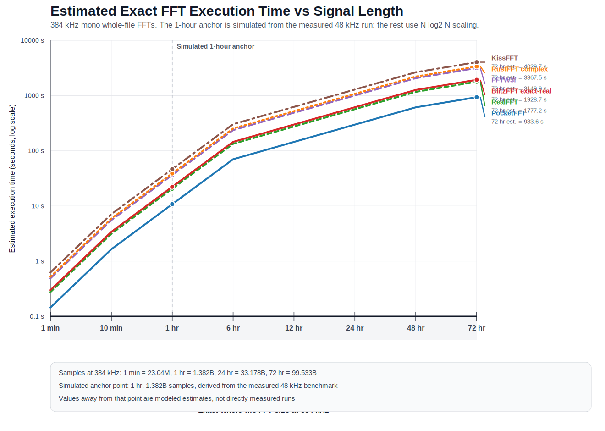

# BlitzFFT

`BlitzFFT` is a Rust CLI for audio Fourier analysis and exact whole-signal FFT benchmarking, with `64-bit` CPU processing and an experimental true `128-bit` `binary128` CPU mode for framed analysis.
It has three complementary jobs:

- framed analysis, similar to an STFT pipeline, with backend auto-selection `CUDA -> Metal -> CPU`
- with frequency estimation errors of ±0.0000028 Hz (vs ±0.023 Hz for 32-bit) on an hour-long window, provide >180 dB SNR for scientific instrumentation applications
- exact whole-file FFT benchmarking on one long real-valued waveform, including `FFTW3f`, `KissFFT`, `PocketFFT`, `RustFFT`, `RealFFT`, and the repo's buffer-reuse real-input path

This repository is partly a tool and partly a notebook on FFT implementation tradeoffs. The code is useful on its own, but it is also a compact place to compare:

- framed versus whole-signal analysis
- real-input FFTs versus complex-input FFTs
- 128-but resolution for ecientific applications, becuase science!
- GPU throughput versus CPU planning and execution costs
- simple libraries versus highly tuned planners
- power-of-two framing constraints versus arbitrary-length exact transforms

## Table of Contents

- [Why this repo exists](#why-this-repo-exists)
- [What changed recently](#what-changed-recently)
- [What an FFT is](#what-an-fft-is)
- [Math conventions used in this repo](#math-conventions-used-in-this-repo)
- [Why real-input FFTs matter](#why-real-input-ffts-matter)
- [How BlitzFFT uses FFTs](#how-blitzfft-uses-ffts)
- [Project architecture](#project-architecture)
- [Build](#build)
- [CLI](#cli)
- [Examples](#examples)
- [Whole-file benchmark methodology](#whole-file-benchmark-methodology)
- [Simulated 60-minute whole-file FFT at 384 kHz](#simulated-60-minute-whole-file-fft-at-384-khz)
- [Estimated scaling to multi-day FFTs at 384 kHz](#estimated-scaling-to-multi-day-ffts-at-384-khz)
- [Repository layout](#repository-layout)
- [Reference map](#reference-map)
- [License](#license)

## Why this repo exists

There are many excellent FFT libraries already. `BlitzFFT` is not trying to replace them all with a single universal implementation. Instead, the repo tries to answer a more practical question:

> For audio work on a real machine, what actually changes when we switch the transform shape, the backend, the planning model, and the library?

That leads to two different workflows:

1. Framed analysis for ordinary audio inspection.
2. Exact whole-file transforms for benchmark and algorithm comparisons.

The framed path is the one most people expect from "audio FFT" software: split a waveform into overlapping windows, apply a tapering function, and transform each frame independently. That is what you want for time-local spectral analysis, spectrogram generation, transient inspection, and quick peak summaries.

The whole-file path is different. It treats the entire waveform as one signal and computes one exact forward FFT over the full sample count. That is useful when you care about:

- exact bin spacing for a long observation interval
- arbitrary, non-power-of-two signal lengths
- comparing library setup cost versus execution cost
- measuring how much work is saved by exploiting real-valued input structure

## What changed recently

- The CPU framed backend now uses `RealFFT` instead of materializing a full complex `RustFFT` input buffer for every frame.
- Framed results no longer allocate an unused full complex spectrum for each frame.
- The repo now has an exact whole-file benchmark path for long real-valued signals, including non-power-of-two lengths.
- The benchmark harness compares six paths side by side: `BlitzFFT exact-real`, `RealFFT`, `RustFFT complex`, `FFTW3f`, `KissFFT`, and `PocketFFT`.
- The benchmark docs now center a simulated one-hour `384` kHz scenario using a `439.997` Hz sine and a full-signal Hann window.

## What an FFT is

An FFT is a fast algorithm for computing the discrete Fourier transform, or DFT.

The DFT takes a finite list of samples and rewrites it as a sum of discrete complex sinusoids. Instead of asking "what is the sample value at time index $n$?", it asks "how much of frequency bin $k$ is present in the signal?"

For a length-$N$ signal $x[n]$, the forward DFT is

$$
X[k] = \sum_{n=0}^{N-1} x[n] e^{-j 2 \pi k n / N}, \qquad 0 \le k < N
$$

and the inverse DFT is

$$
x[n] = \frac{1}{N} \sum_{k=0}^{N-1} X[k] e^{j 2 \pi k n / N}
$$

If you implement that definition directly, it costs $O(N^2)$ operations. The FFT family of algorithms computes the same result in roughly $O(N \log N)$ time by factoring the problem into smaller transforms.

That is the whole reason FFTs matter. They do not change the transform being computed. They change the cost of computing it.

### Intuition

Some quick intuition helps:

- the time-domain signal is a sequence of samples
- the frequency-domain signal is a sequence of complex coefficients
- each coefficient describes the amplitude and phase of one discrete frequency bin
- a longer observation window gives finer frequency spacing
- a shorter observation window gives better time localization

The bin frequencies are

$$
f_k = \frac{k f_s}{N}
$$

where $f_s$ is the sample rate. The frequency resolution is therefore

$$
\Delta f = \frac{f_s}{N}
$$

This is why a one-hour signal at $48{,}000$ Hz has extremely fine bin spacing: the observation interval is very long, so the frequency grid is correspondingly dense.

### Why the FFT is "fast"

The most famous FFT family is the Cooley-Tukey decomposition. When $N$ factors as $N = N_1 N_2$, the transform can be reorganized into smaller pieces instead of recomputing every sinusoid against every sample from scratch. There are many variants:

- radix-2 and radix-4 decompositions
- mixed-radix decompositions
- split-radix variants
- prime-factor algorithms
- Bluestein and Rader methods for awkward lengths, especially primes

Different libraries package those ideas differently. Some are tiny and simple. Others, like FFTW, search over many possible plans and choose the fastest measured one for the host machine.

## Math conventions used in this repo

`BlitzFFT` follows the standard forward-transform sign convention with a negative exponential:

$$
e^{-j 2 \pi k n / N}
$$

Some practical conventions matter when you compare FFT libraries:

- Most FFT libraries return an unnormalized forward transform.
- Normalization, if desired, is usually applied separately.
- For real-valued input, the negative-frequency half of the spectrum is redundant.

For a real signal,

$$
X[N-k] = \overline{X[k]}
$$

so a real-input forward FFT only needs to return the nonnegative-frequency half-spectrum:

$$
k = 0, 1, \dots, \left\lfloor \frac{N}{2} \right\rfloor
$$

That is why the positive-frequency output length is

$$
\frac{N}{2} + 1
$$

for even $N$.

## Why real-input FFTs matter

Audio samples are real-valued. That sounds obvious, but it changes the implementation story a lot.

If you feed a real signal into a generic complex FFT, you usually have to:

1. allocate a complex buffer of length $N$
2. copy each real sample into the real part
3. set all imaginary parts to zero
4. compute a full complex FFT
5. ignore half the result because it is conjugate-redundant

A real-input FFT avoids most of that waste. In practical terms, that can mean:

- less input marshaling
- less memory traffic
- less output storage
- faster execution
- a cleaner API for audio workloads

`RealFFT` in Rust builds on `RustFFT` but exposes the real-to-complex path directly. `FFTW3f`, `KissFFT`, and `PocketFFT` also provide real-input transforms. This repo makes that comparison explicit.

## How BlitzFFT uses FFTs

There are two very different transform modes in this repository.

### 1. Framed analysis

The framed path is an STFT-style workflow:

1. load or synthesize audio
2. downmix to mono if needed
3. split the signal into overlapping frames
4. apply a Hann window per frame
5. compute one FFT per frame
6. emit magnitudes, summaries, CSV, or binary output

For frame index $m$, hop size $H$, and frame length $N$, the transform is

$$
X_m[k] = \sum_{n=0}^{N-1} x[n + mH] \, w[n] \, e^{-j 2 \pi k n / N}
$$

where $w[n]$ is the analysis window.

The Hann window used in this repo is

$$
w[n] = \frac{1}{2} \left(1 - \cos\left(\frac{2 \pi n}{N - 1}\right)\right), \qquad 0 \le n < N
$$

In the CPU framed backend, the transform work is done with cached `RealFFT` plans plus thread-local work buffers. On Apple hardware, the Metal backend applies the frame window on-device. On NVIDIA systems, the CUDA backend is preferred when enabled and available.

### 2. Whole-file exact benchmark

The whole-file mode computes one forward FFT over the entire signal:

$$
X[k] = \sum_{n=0}^{N-1} x[n] e^{-j 2 \pi k n / N}
$$

This is not an STFT. There is no hop size and no time-local frame index. You get one spectrum covering the full observation interval.

That is why the reported frequency resolution for the one-hour example is

$$
\Delta f = \frac{384000}{1382400000} = \frac{1}{3600} \approx 0.0002777778 \text{ Hz}
$$

This mode exists to compare transform engines and data-motion costs, not to provide time-local spectral evolution.

### Tuning-theory interpretation of a tiny interval

The value above is a linear frequency-bin spacing in hertz. If, separately, you want to think about a similarly sized interval in logarithmic pitch space, take

$$
\Delta = 0.0002777778
$$

interpreted as a base-2 log-frequency interval. The corresponding frequency ratio is

$$
\text{ratio} = 2^{0.0002777778} \approx 1.0001925
$$

A cent, written `¢`, is one hundredth of a semitone, or `1/1200` of an octave. The equivalent size here is

$$
1200 \cdot 0.0002777778 = 0.33333336 \, \text{¢}
$$

So that target interval is approximately:

- `0.3333 ¢`
- `1.0001925` as a frequency ratio

It is also exactly one step of `3600-EDO`, since

$$
\frac{1200}{3600} = \frac{1}{3} \, \text{¢}
$$

per equal division of the octave.

This is smaller than the usual named commas in tuning theory. A useful nearby reference is one sixth of a schisma. Using

$$
\text{schisma} \approx 1.95 \, \text{¢}
$$

gives

$$
\frac{1.95}{6} \approx 0.325 \, \text{¢}
$$

so

$$
\frac{1}{6}\text{ schisma} \approx 0.325 \, \text{¢}
$$

which is very close to `0.3333 ¢`, with an error of about `0.008 ¢`.

## Project architecture

At a high level, the project is organized like this:

- `src/main.rs`
  CLI parsing, input selection, framing, backend selection, and dispatch
- `src/audio.rs`
  WAV loading, mono downmixing, Hann windows, framing, sine synthesis, and bin-to-Hz conversion
- `src/backends/`
  framed FFT backends for CPU, Metal, and CUDA
- `src/benchmark.rs`
  framed benchmark harness comparing the selected backend against the CPU baseline
- `src/whole_fft.rs`
  exact whole-signal benchmark harness across multiple FFT libraries
- `src/native/pocketfft_bridge.cc`
  thin C++ bridge exposing vendored PocketFFT to Rust
- `vendor/kissfft/`
  vendored KISS FFT sources
- `vendor/pocketfft/`
  vendored PocketFFT header-only implementation

### Backend selection

Automatic backend selection is:

```text
CUDA -> Metal -> CPU
```

If you force a backend from the CLI, that explicit choice wins.

### What each whole-file benchmark entry means

The benchmark table compares closely related but not identical implementation styles:

- `BlitzFFT exact-real`
  A real-input path built around `RealFFT` plan creation plus reusable input, output, and scratch buffers.
- `RealFFT`
  A direct `realfft` crate benchmark path that still uses a real-input transform, but with less aggressive buffer reuse in the harness.
- `RustFFT complex`
  A baseline that converts the real signal into a full complex buffer and runs a standard complex FFT.
- `FFTW3f`
  The single-precision real-to-complex FFTW path discovered from the local machine.
- `KissFFT`
  The real FFT path from the vendored KISS FFT C implementation.
- `PocketFFT`
  A vendored C++ header-only path accessed through `src/native/pocketfft_bridge.cc`.

That means the benchmark is not just "algorithm A versus algorithm B". It is also measuring planning policy, data layout policy, and buffer-management style.

When `--precision 64` is selected, the whole-file benchmark currently uses the CPU-side `RealFFT` and `RustFFT` double-precision paths plus the repo's reusable exact-real path. The vendored `PocketFFT`, `KissFFT`, and linked `FFTW3f` comparisons remain single-precision-only in this codebase today.

## Build

```bash
# CPU + exact whole-file benchmarks
cargo build --release

# Apple GPU backend
cargo build --release --features metal

# NVIDIA GPU backend
cargo build --release --features cuda

# Everything enabled
cargo build --release --features "cuda metal"
```

### Build notes

- `FFTW3f` is required for the whole-file benchmark table that includes FFTW.
- `build.rs` first tries `pkg-config --libs --cflags fftw3f`.
- If `pkg-config` does not succeed, `build.rs` falls back to checking `/opt/homebrew/lib` and `/usr/local/lib` for `libfftw3f.dylib`.
- `KissFFT` is compiled from the vendored C sources in `vendor/kissfft/`.
- `PocketFFT` is compiled through a small C++ bridge against the vendored header in `vendor/pocketfft/`.
- The Metal shader is built by `build.rs` when the `metal` feature is enabled.
- The CPU path always remains available.

## CLI

The project name is `BlitzFFT`. The current binary name is still `audiofft`.

```text
Usage: audiofft [OPTIONS] [INPUT]

Arguments:
  [INPUT]  Input WAV file (16/24/32-bit PCM or f32)

Options:
  -n, --fft-size <FFT_SIZE>            FFT frame size (must be a power of two) [default: 2048]
      --hop <HOP>                      Hop size in samples (default = fft_size/2)
      --batch-size <BATCH_SIZE>        Number of frames to process per GPU batch (default = all frames) [default: 0]
  -b, --backend <BACKEND>              Force a specific backend [default: auto]
      --channel <avg|left|right|N>     Input channel selection [default: avg]
      --window <WINDOW>                Window applied to each analysis frame [default: hann] [possible values: rect, hann, hamming, blackman]
      --precision <PRECISION>          Internal processing precision in bits [default: 64] [possible values: 32, 64, 128]
  -o, --output <PATH>                  Output file (optional; stdout if omitted for text/csv)
  -f, --format <FORMAT>                Output format [default: text]
      --min-hz <MIN_HZ>                Only emit bins at or above this frequency
      --max-hz <MAX_HZ>                Only emit bins at or below this frequency
      --top-bins <TOP_BINS>            Only emit the N loudest bins per frame (0 = all bins) [default: 0]
      --benchmark                      Run framed benchmark comparing selected backend against CPU baseline
      --bench-repeats <BENCH_REPEATS>  Number of benchmark repeats [default: 5]
      --whole-file-benchmark           Run one exact FFT over the entire signal
      --generate-sine <Hz,SR,Secs>     Synthesize a sine wave in memory
      --write-generated-wav <PATH>     Persist the generated/loaded mono signal as 32-bit float WAV
      --full-window <FULL_WINDOW>      Apply a window across the entire loaded/generated signal before whole-file FFT
      --apply-full-hann                Apply a Hann window across the entire loaded/generated signal
      --summary                        Print per-frame peak-frequency summary to stdout
```

### Input and output behavior

- WAV input supports 16-bit PCM, 24-bit PCM, 32-bit PCM, and 32-bit float.
- Multi-channel input can be averaged to mono or a single channel can be selected with `--channel`.
- Framed output can be emitted as `text`, `csv`, `json`, `bin`, or `none`.
- `--min-hz` and `--max-hz` limit emitted `text`, `csv`, and `json` bins plus summary peaks to a frequency band.
- `--window` controls framed analysis windows, while `--full-window` applies a whole-signal window before an exact whole-file FFT.
- `--precision 64` enables double-precision CPU processing for framed analysis and a reduced whole-file benchmark set.
- `--precision 128` enables an experimental true `binary128` CPU path for framed analysis.
- `--precision 128` currently does not support `--whole-file-benchmark`, and it does not use GPU backends.
- Whole-file benchmark mode prints a comparison table and exits.

## Examples

### Standard framed analysis

```bash
cargo run --release -- input.wav --backend cpu --summary -f none
```

### Analyze only the left channel in a frequency band

```bash
cargo run --release -- input.wav --channel left --min-hz 80 --max-hz 5000 --summary -f none
```

### Run framed analysis in double precision

```bash
cargo run --release -- input.wav --precision 64 --backend cpu --summary -f none
```

### Run framed analysis in experimental true 128-bit precision

```bash
cargo run --release -- input.wav --precision 128 --backend cpu --summary -f none
```

The current `128-bit` path uses Rust's unstable `f128` type with crate-local math helpers for trig and square root, enabled for this crate via `.cargo/config.toml`. That keeps the processing path native Rust while avoiding the broken platform `f128` trig/sqrt symbols on this macOS target.

### Framed benchmark against the CPU baseline

```bash
cargo run --release -- input.wav --benchmark --bench-repeats 5 -f none
```

### Whole-file exact FFT benchmark on an existing WAV

```bash
cargo run --release -- input.wav --full-window hann --whole-file-benchmark --bench-repeats 1 -f none
```

### Whole-file benchmark in double precision

```bash
cargo run --release -- input.wav --precision 64 --backend cpu --full-window hann --whole-file-benchmark --bench-repeats 1 -f none
```

### Generate a sine wave and benchmark the entire signal

```bash
target/release/audiofft \
  --generate-sine 439.997,384000,3600 \
  --apply-full-hann \
  --write-generated-wav data/sine_439p997hz_60min_384khz_f32_hann.wav \
  --whole-file-benchmark \
  --bench-repeats 1 \
  -f none
```

### Export framed magnitudes to CSV

```bash
cargo run --release -- input.wav --fft-size 4096 --hop 1024 --format csv --output spectrum.csv
```

### Export filtered spectra as JSON

```bash
cargo run --release -- input.wav --window blackman --min-hz 20 --max-hz 2000 --format json --output spectrum.json
```

## Whole-file benchmark methodology

This section matters because FFT benchmarks are easy to misread.

### What is being timed

The whole-file table reports two times:

- `Setup`
  planner creation, config creation, allocation, or equivalent transform preparation
- `Exec`
  one measured transform run, excluding WAV load time but including any algorithm-specific input marshaling performed by the benchmark harness

That distinction is important. A planner-heavy library can look slower in one-shot runs even if it is excellent when a plan is reused many times. Conversely, a lightweight library can look great in a single transform but lose ground when the workload changes shape or dimensionality.

### What the benchmark is not claiming

The table is useful, but it is not a universal ranking of FFT libraries.

It does **not** mean:

- the fastest library here is always fastest for every size and workload
- the slowest library here is poorly engineered
- framed STFT workloads will behave the same way as one giant transform
- setup and execution costs will scale identically on every machine

It **does** show:

- how these exact implementations behave in this repository
- how much real-input optimization changes the picture
- how much data conversion overhead hurts the full complex baseline
- how sharp the frequency resolution becomes when $N$ is very large

### Why the full-signal Hann window is included

The benchmark asset is windowed across the **entire** one-hour signal before the exact whole-file FFT. That is unusual compared with frame-by-frame STFT work, but it makes the benchmarked signal handling explicit and reproducible.

The full-signal Hann is

$$
w[n] = \frac{1}{2} \left(1 - \cos\left(\frac{2 \pi n}{N - 1}\right)\right)
$$

applied for $0 \le n < N$ across the entire loaded or synthesized waveform.

## Simulated 60-minute whole-file FFT at 384 kHz

Updated on `2026-04-01` for a mono $384$ kHz, `32-bit` float, one-hour sine-wave scenario with:

- frequency: `439.997 Hz`
- duration: `3600 s`
- samples: `1,382,400,000`
- frequency resolution:

$$
\Delta f = \frac{384000}{1382400000} = \frac{1}{3600} \approx 0.0002777778 \text{ Hz}
$$

- nearest-bin frequency to the target sine:

$$
f_{\text{peak}} = \frac{1{,}583{,}989}{3600} \approx 439.996944444444 \text{ Hz}
$$

- window: full-signal Hann window applied before the FFT
- command: the reproduction command shown above

The corresponding WAV would be about `5.15 GiB` on disk. In this workspace, the one-hour `384` kHz benchmark is treated as a simulation anchored to the measured `48` kHz run, because a direct six-library exact rerun at `1.3824` billion samples would exceed practical local memory and disk limits.

The table below therefore reports a simulated one-hour anchor. `Exec` is projected with the same $N \log_2 N$ model used in the scaling graph. `Peak freq (Hz)` is shown at much higher precision so the off-bin `439.997` Hz target is visible.

| Algorithm | Setup (s) | Exec (s) | Peak bin | Peak freq (Hz) |
|---|---:|---:|---:|---:|
| PocketFFT | simulated | 10.776736 | 1,583,989 | 439.996944444444 |
| RealFFT | simulated | 20.514858 | 1,583,989 | 439.996944444444 |
| BlitzFFT exact-real | simulated | 22.263636 | 1,583,989 | 439.996944444444 |
| FFTW3f | simulated | 36.360388 | 1,583,989 | 439.996944444444 |
| RustFFT complex | simulated | 38.872592 | 1,583,989 | 439.996944444444 |
| KissFFT | simulated | 46.515731 | 1,583,989 | 439.996944444444 |

The same numbers are also recorded in [`benchmarks/60min_whole_file_fft.md`](benchmarks/60min_whole_file_fft.md).

## Estimated scaling to multi-day FFTs at 384 kHz

The simulated table above gives one exact-size anchor point at

$$
N_0 = 1{,}382{,}400{,}000
$$

samples, or one hour of mono audio at $384$ kHz.

To visualize how the whole-file execution time should grow as the FFT gets longer, the graph below extrapolates each algorithm's simulated `Exec` time with an $N \log_2 N$ model:

$$
\hat{T}(N) = T(N_0) \frac{N \log_2 N}{N_0 \log_2 N_0}
$$

This is an **execution-time scaling estimate**, not a fresh measured benchmark at every duration. The one-hour `384` kHz anchor is itself simulated from the measured `48` kHz benchmark by the same $N \log_2 N$ model. It does not try to model planner heuristics, cache cliffs, allocator behavior, out-of-core I/O, or OS-level memory pressure for truly enormous transforms.

To regenerate the chart after updating the anchor timings, run:

```bash
python3 scripts/generate_whole_fft_scaling_svg.py
```



At the multi-day end of that estimate, the projected execution times at $384$ kHz are:

| Duration | Samples | PocketFFT | RealFFT | BlitzFFT exact-real | FFTW3f | RustFFT complex | KissFFT |
|---|---:|---:|---:|---:|---:|---:|---:|
| 24 hr | 33,177,600,000 | 297.696 s | 566.701 s | 615.009 s | 1004.417 s | 1073.814 s | 1284.948 s |
| 48 hr | 66,355,200,000 | 612.428 s | 1165.832 s | 1265.213 s | 2066.312 s | 2209.077 s | 2643.427 s |
| 72 hr | 99,532,800,000 | 933.589 s | 1777.203 s | 1928.700 s | 3149.902 s | 3367.535 s | 4029.660 s |

## Repository layout

```text
BlitzFFT/
|- data/
|  `- generated benchmark WAVs (for example, a 384 kHz 60-minute sine asset; not checked in)
|- src/
|  |- main.rs
|  |- audio.rs
|  |- benchmark.rs
|  |- output.rs
|  |- whole_fft.rs
|  |- native/
|  |  `- pocketfft_bridge.cc
|  `- backends/
|     |- mod.rs
|     |- cpu.rs
|     |- cuda.rs
|     `- metal.rs
|- vendor/
|  |- kissfft/
|  `- pocketfft/
`- shaders/
   `- fft.metal
```

## Reference map

This section is intentionally broad and repo-focused. It is not literally the entire FFT literature, but it does collect the main sources relevant to the theory, libraries, and design choices that appear in `BlitzFFT`.

### Core FFT and DFT references

- J. W. Cooley and J. W. Tukey, "An algorithm for the machine calculation of complex Fourier series," *Mathematics of Computation*, 1965. DOI: [10.1090/S0025-5718-1965-0178586-1](https://doi.org/10.1090/S0025-5718-1965-0178586-1)
- Matteo Frigo and Steven G. Johnson, "The Design and Implementation of FFTW3," *Proceedings of the IEEE*, 2005. PDF: [fftw-paper-ieee.pdf](https://www.fftw.org/fftw-paper-ieee.pdf)
- FFTW manual, especially "What FFTW Really Computes": [https://www.fftw.org/doc/](https://www.fftw.org/doc/)
- FFTPACK at Netlib, important because PocketFFT is a heavily modified FFTPACK descendant: [https://www.netlib.org/fftpack/](https://www.netlib.org/fftpack/)
- Bluestein-style handling of difficult lengths is summarized in the PocketFFT README and commonly associated with the chirp z-transform family: [https://en.wikipedia.org/wiki/Chirp_Z-transform](https://en.wikipedia.org/wiki/Chirp_Z-transform)

### Windowing and spectral analysis references

- F. J. Harris, "On the Use of Windows for Harmonic Analysis with the Discrete Fourier Transform," *Proceedings of the IEEE*, 1978. DOI: [10.1109/PROC.1978.10837](https://doi.org/10.1109/PROC.1978.10837)
- Julius O. Smith III, online DSP references on spectral analysis and windows: [https://ccrma.stanford.edu/~jos/](https://ccrma.stanford.edu/~jos/)

### FFTW references

- FFTW home page: [https://www.fftw.org/](https://www.fftw.org/)
- FFTW manual top page: [https://www.fftw.org/doc/](https://www.fftw.org/doc/)
- FFTW paper: [https://www.fftw.org/fftw-paper-ieee.pdf](https://www.fftw.org/fftw-paper-ieee.pdf)
- Relevant manual topics for this repo:
  - planner and wisdom
  - real-data DFTs
  - "What FFTW Really Computes"

### KISS FFT references

- Upstream repository: [https://github.com/mborgerding/kissfft](https://github.com/mborgerding/kissfft)
- Upstream README: [https://github.com/mborgerding/kissfft/blob/master/README.md](https://github.com/mborgerding/kissfft/blob/master/README.md)
- Vendored copy in this repo: [`vendor/kissfft/README.md`](vendor/kissfft/README.md)
- SIMD notes: [`vendor/kissfft/README.simd`](vendor/kissfft/README.simd)

Why it matters here: KISS FFT is a good contrast case against FFTW. It aims to stay simple and reasonably efficient rather than planner-heavy and maximally optimized for every machine.

### PocketFFT references

- Original upstream noted by the GitHub mirror: [https://gitlab.mpcdf.mpg.de/mtr/pocketfft](https://gitlab.mpcdf.mpg.de/mtr/pocketfft)
- GitHub mirror used as a convenient public reference: [https://github.com/mreineck/pocketfft](https://github.com/mreineck/pocketfft)
- Vendored README in this repo: [`vendor/pocketfft/README.md`](vendor/pocketfft/README.md)
- PocketFFT README highlights relevant to this repo:
  - real-to-complex and complex-to-real transforms
  - mixed support for awkward sizes
  - Bluestein handling for large prime factors
  - plan caching for repeated sizes

Why it matters here: PocketFFT is a strong exact-whole-signal comparison point because it is compact, modern C++, and explicitly optimized for more than just textbook radix-2 cases.

### RustFFT and RealFFT references

- `rustfft` crate docs: [https://docs.rs/crate/rustfft/latest](https://docs.rs/crate/rustfft/latest)
- `realfft` crate docs: [https://docs.rs/crate/realfft/latest](https://docs.rs/crate/realfft/latest)
- `realfft` crate summary: it wraps `rustfft` to expose real-to-complex and complex-to-real transforms directly, avoiding manual real-to-complex expansion in user code

Why they matter here:

- the framed CPU backend uses `RealFFT`
- the whole-file benchmark compares `RealFFT` and `RustFFT complex` directly
- the repo's "exact-real" benchmark path is mostly about planner and buffer reuse around a real-input transform, not about inventing a brand-new Fourier algorithm

### Repo-local implementation references

- [`src/audio.rs`](src/audio.rs)
  WAV loading, mono downmixing, Hann window generation, and framing
- [`src/backends/cpu.rs`](src/backends/cpu.rs)
  cached `RealFFT` plans plus thread-local reusable work buffers
- [`src/whole_fft.rs`](src/whole_fft.rs)
  exact whole-signal benchmark harness and per-library bridge code
- [`src/native/pocketfft_bridge.cc`](src/native/pocketfft_bridge.cc)
  Rust-to-PocketFFT bridge
- [`build.rs`](build.rs)
  KISS FFT compilation, PocketFFT bridge compilation, FFTW linking, and Metal shader compilation

## License

MIT
